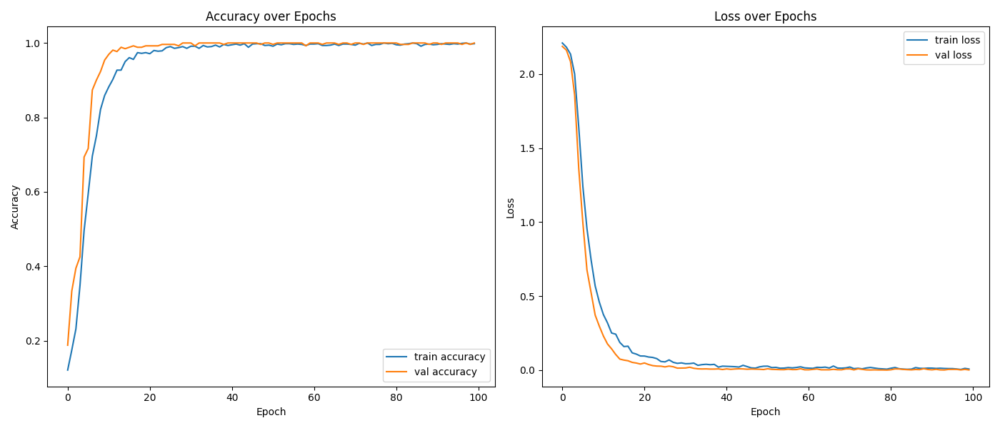

# captcha-solver

使用 Python 3.12 开发。

## 特殊目录

- `data` 目录用于保存数据集。
- `model` 目录用于保存模型文件。

## 教程

- 运行 `dataset.py` 制作数据集。`data.zip` 是我制作的数据集，可将图片放入 `data` 目录使用。
- 运行 `train.py` 训练模型。
- 运行 `predict.py` 使用模型预测验证码。

## 训练结果

