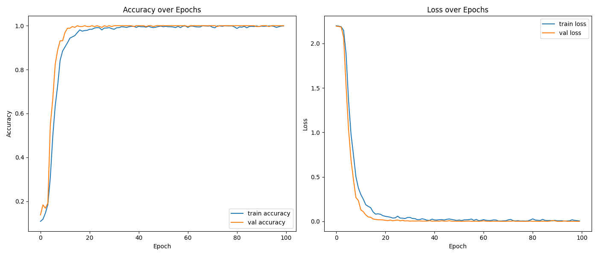
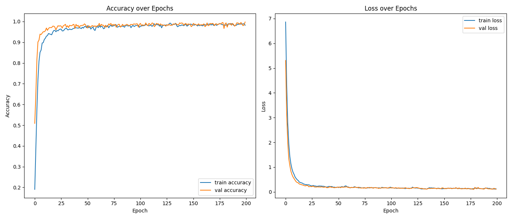

# captcha-solver

使用 Python 3.12 开发。

## 目录

- `data/payment` 保存电费数据集。
- `data/zfw` 保存自服务数据集。
- `model` 保存模型文件。

## 教程

- 运行 `dataset.py` 制作数据集。`data/data.zip` 是我制作的数据集，可以直接使用。
- 运行 `train.py` 训练模型。
- 运行 `predict.py` 使用模型预测验证码。

## 训练结果

- 电费验证码

    

- 自服务验证码

    
